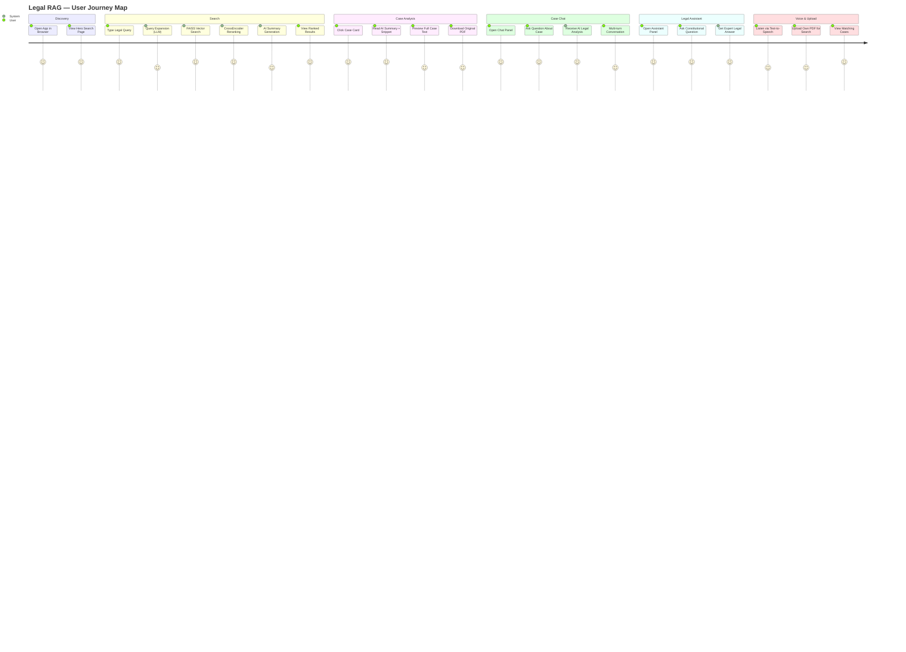
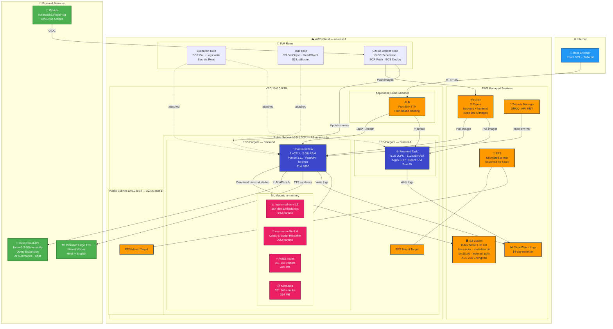
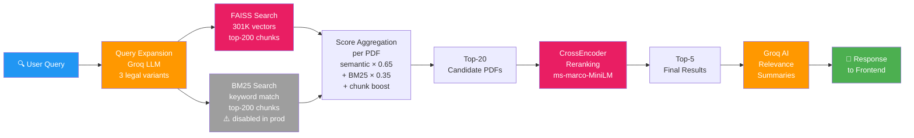
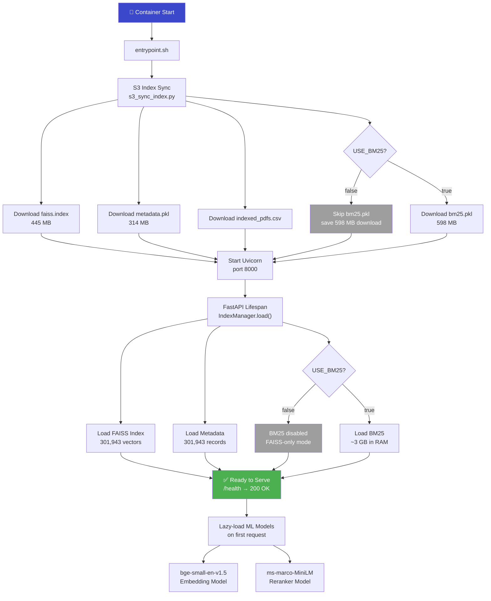
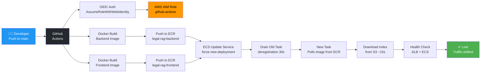

# Legal RAG — Architecture Diagrams

## 1. User Journey Map

---

## 2. Detailed System Design & Deployment Architecture

---

## 3. Search Pipeline Flow

---

## 4. Container Startup Flow

---

## 5. CI/CD Deployment Flow

ECS Fargate — Backend

HTTP :80

/api/* · /health

/* (default)

Download index
at startup

LLM API calls

TTS synthesis

Inject env var

attached

attached

attached

Pull images

Pull images

Write logs

Write logs

OIDC

Push images

Update service

ML Models (in-memory)

📊 bge-small-en-v1.5
384-dim Embeddings
33M params

🔄 ms-marco-MiniLM
Cross-Encoder Reranker
22M params

⚡ FAISS Index
301,943 vectors
445 MB

📋 Metadata
301,943 chunks
314 MB

👤 User Browser
React SPA + Tailwind

ALB
Port 80 HTTP
Path-based Routing

🐍 Backend Task
1 vCPU · 2 GB RAM
Python 3.11 · FastAPI · Uvicorn
Port 8000

🌐 Frontend Task
0.25 vCPU · 512 MB RAM
Nginx 1.27 · React SPA
Port 80

EFS Mount Target

ECS Fargate — Frontend

